# IO流

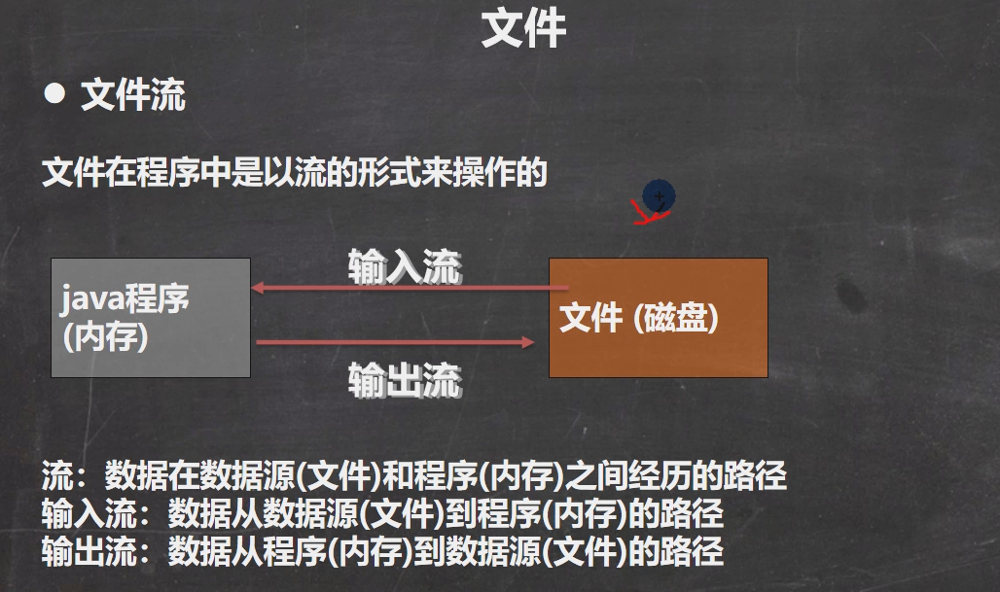

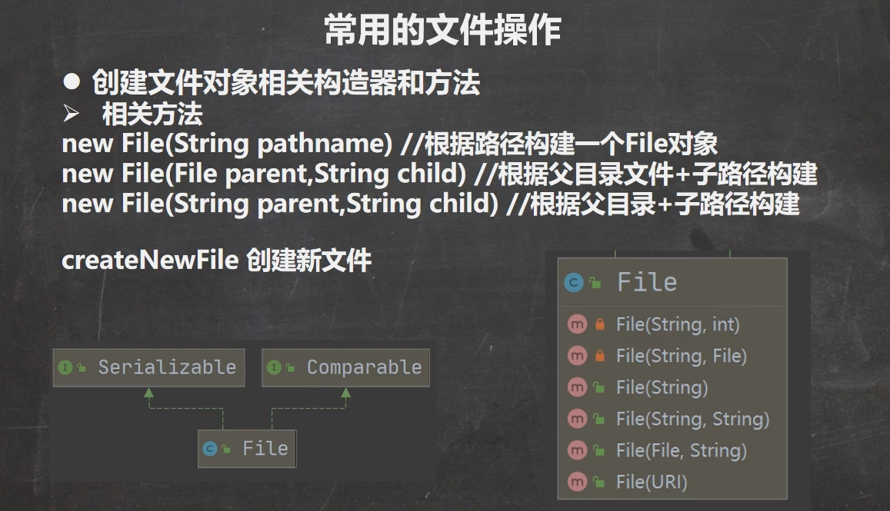

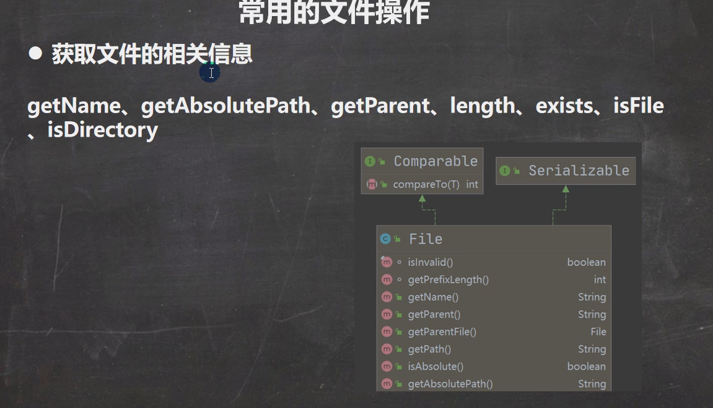

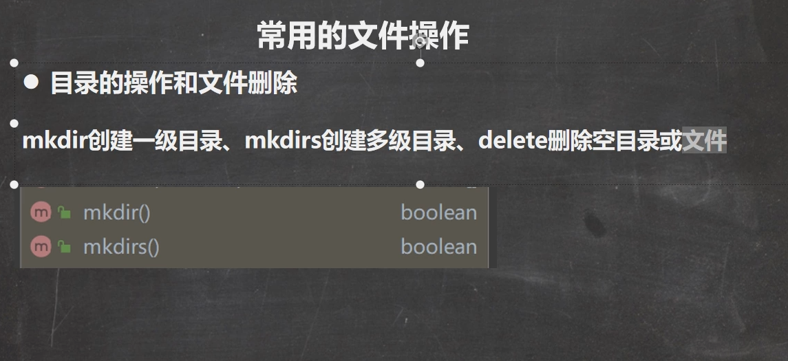

## ==**目录也是文件**==

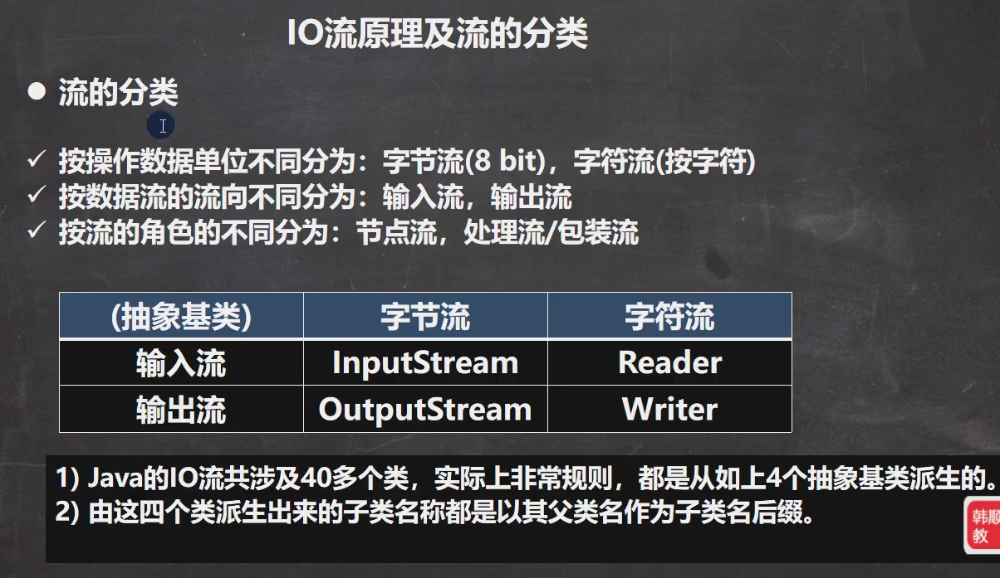

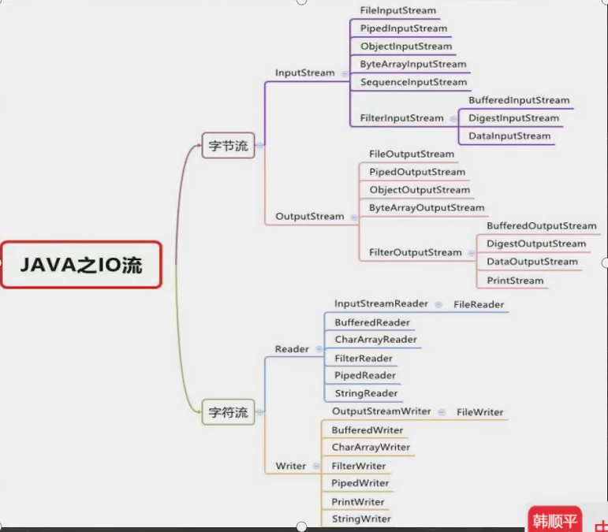

# InputStream

常用子类

https://www.cainiaojc.com/java/java-fileinputstream.html

1. FileInputStream：文件输入流

   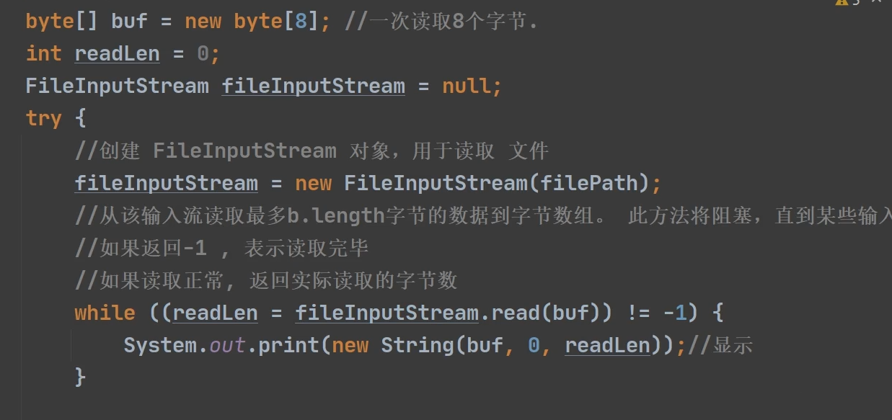

   

2. BufferedInputStream：缓冲字节输入流

3. ObjectInputStream：对象字节输入流

## OutputStream

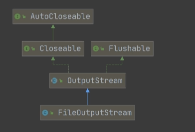


三种写入的方式：

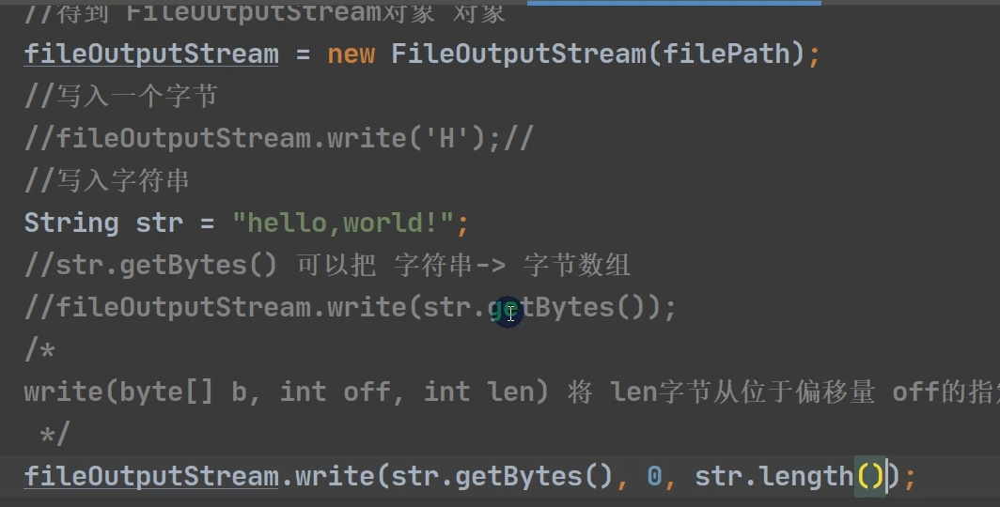

拷贝文件的时候需要用第三种方法，不然会有多余的字节产生。

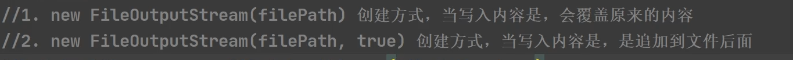


# FileReader和FileWriter

==按照字符来操作io==

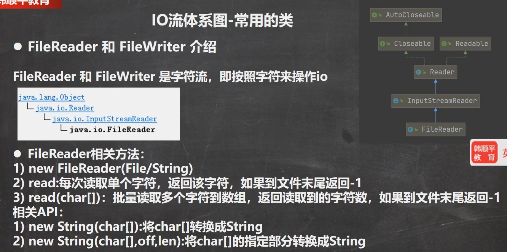


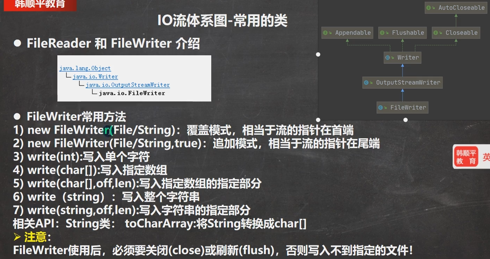

为啥执行close()方法执行后才会写入数据，因为底层会调用writerBytes方法

flush()方法底层也是调用的这个，close()方法等于flush()+关闭

# 节点流和处理流

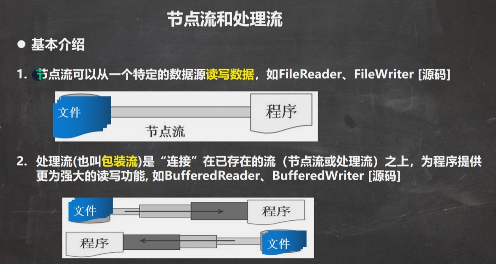

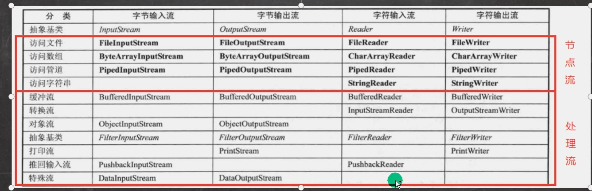

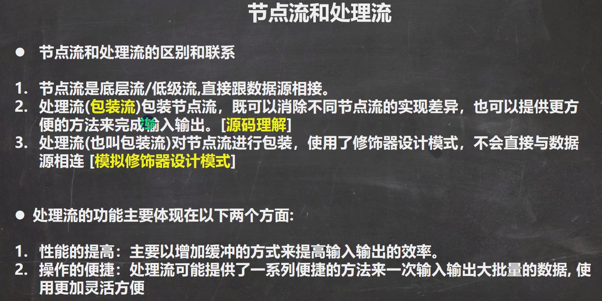

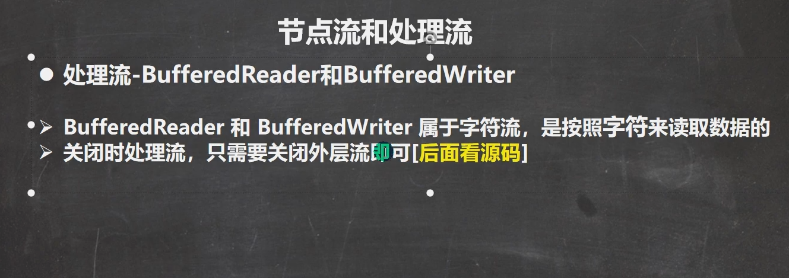

1. BufferedReader 和 BufferedWriter 是按照字符操作
2. 不能操作二进制文件[声音、视频]可能会造成文件损坏

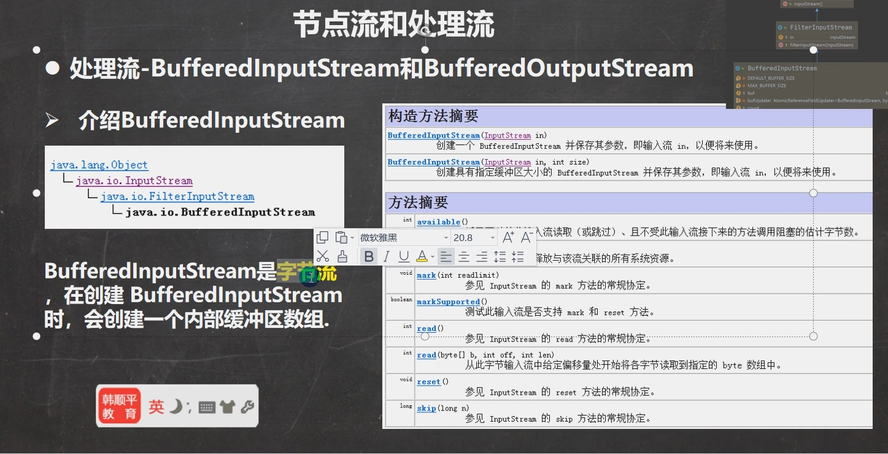

字节流的处理方法能操作文件（字符是由字节组成的），反之不行。

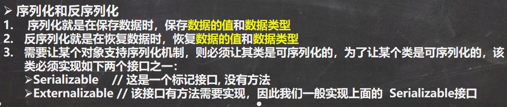


## ObjectOutputStream和ObjectInputStream

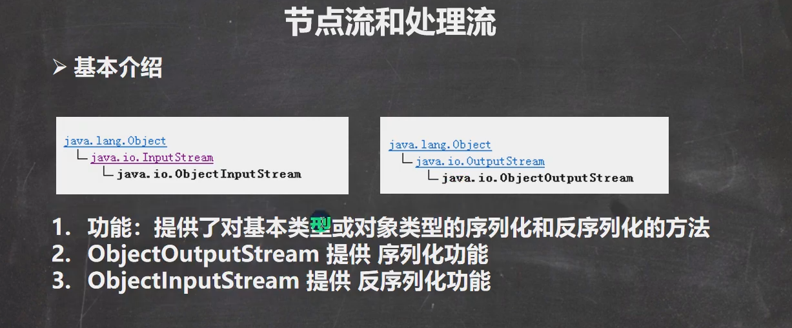

## ObjectOutputStream

常用方法：

- write() - 将字节数据写入输出流
- writeBoolean() - 以布尔形式写入数据
- writeChar() - 以字符形式写入数据
- writeInt() - 以整数形式写入数据
- writeUTF-以字符串形式写入数据
- writeObject() - 将对象写入输出流

## ObjectIutputStream

**InputStream类提供了由其子类实现的不同方法。以下是一些常用的方法**

- read() - 从输入流中读取一个字节的数据
- read(byte[] array) - 从流中读取字节并存储在指定的数组中
- available() - 返回输入流中可用的字节数
- mark() - 标记输入流中数据所在的位置
- reset() -将控制点返回到流中设置标记的点
- markSupported()- 检查流中是否支持mark()和reset()方法
- skips() - 跳过和丢弃输入流中的指定字节数
- close() - 关闭输入流

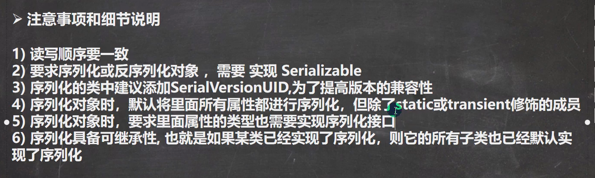

## 标准输入输出流

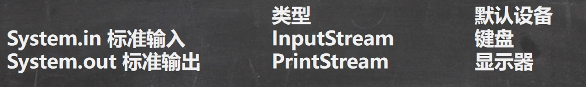

Systeam.in 编译类型: InputStream，运行类型: BufferedInputStream 表示的是标准输入键盘

Systeam.out 编译类型: PrintStream，运行类型: PrintStream 表示的是标准输出 显示器

## 转换流 InputStreamReader和OutputStreamWriter

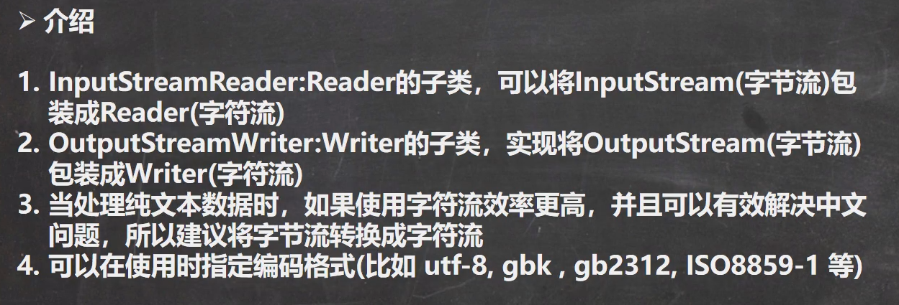

InputStream是字节流的抽象类，Reader是字符流的抽象类，将字节流转换成字符流即：InputStreamReader

OutputStream是字节流的抽象类，Writer是字符流的抽象类，将字节流转换成字符流即：OutputStreamWriter

常用于在指定写入、读取数据的字符编码类型（**UTF8**或**UTF16**）。

```java
FileInputStream file = new FileInputStream(String path);
InputStreamReader input = new InputStreamReader(file, Charset cs);

入器。

//创建一个OutputStream
FileOutputStream file = new FileOutputStream(String path);

//创建一个OutputStreamWriter，指定字符编码
OutputStreamWriter output = new OutputStreamWriter(file, Charset cs);
```

## 打印流-PrintStream和PrintWriter

打印流只有输出流没有输入流

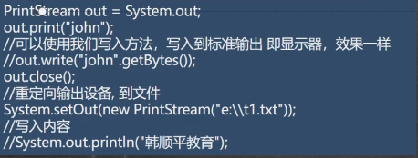

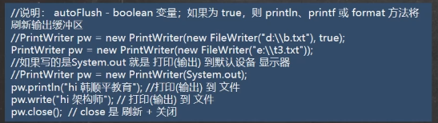

## Properties类


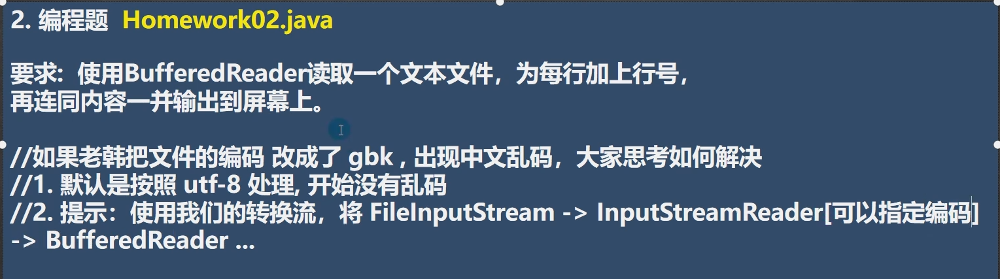