# 线程

==进程==：

进程（Process）是计算机中的程序关于某数据集合上的一次运行活动，是==系统进行资源分配和调度的基本单位==，是[操作系统](https://baike.baidu.com/item/操作系统)结构的基础。在早期面向进程设计的计算机结构中，进程是程序的基本执行实体；在当代面向线程设计的计算机结构中，==进程是线程的容器==。程序是指令、数据及其组织形式的描述，进程是程序的实体。

进程是指运行中的程序，进程也是程序的一次执行过程，或是正在运行的一个程序，是动态过程：有它自身的产生、存在和消亡的过程。

==线程==：

1.线程由进程创建，是进程的一个实体

2.一个进程可以拥有多个线程。

==单线程==：同一时刻，只允许执行一个线程

==多线程==：同一时刻，可以执行多个线程，比如一个迅雷进程，可以同时下载多个文件

==并发==：同一时刻，多个任务交替执行，造成一种"貌似同时"的错觉，简单来说，单核cpu实现的多任务就是并发

==并行==：同一时刻，多个任务同时执行。多核cpu可以实现并行。

## 线程的基本使用

在Java中线程使用有两种方法

1.继承Thread类，重写run方法

2.实现Runnable接口，重写run方法


主线程启动子线程后，主线程并不会阻塞

所有的线程结束，进程才会结束

## 线程终止

基本说明：

1. 当线程完成任务后，会自动退出
2. 还可以通过使用变量来控制run方法退出的方式停止线程，即通知方式

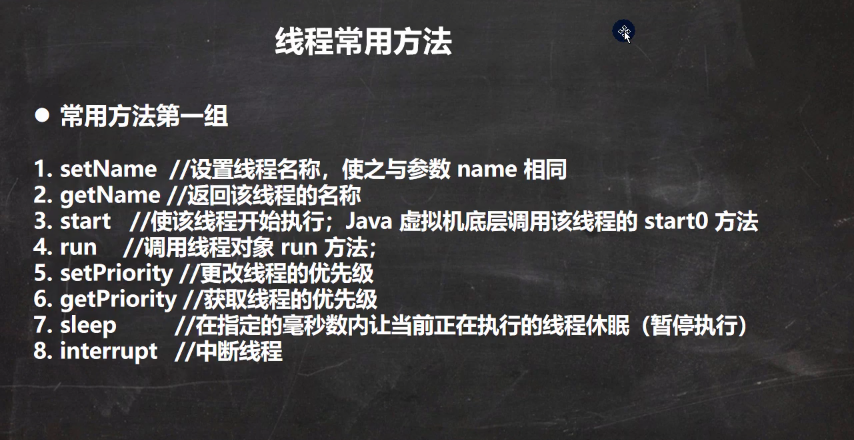

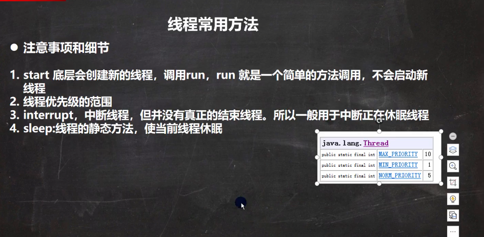


# 线程插队

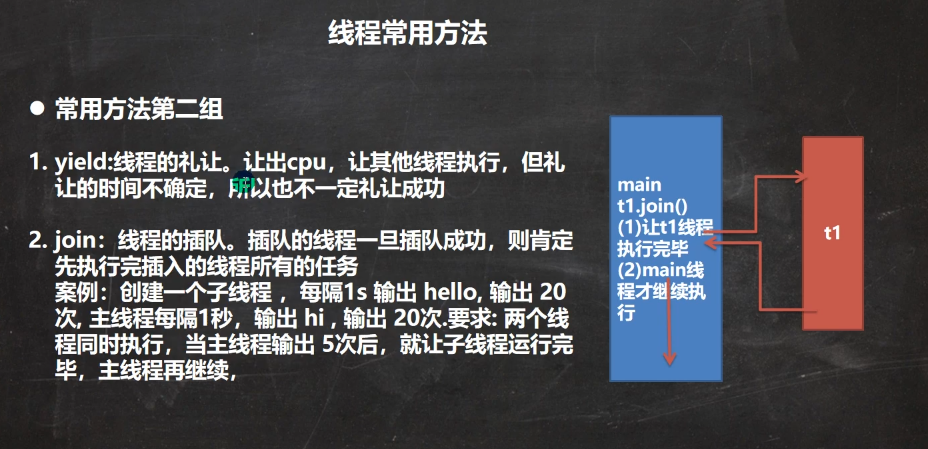

yield()根据cpu资源来判定，资源够就不用让了

join()方法是调用对方的，谁插队调谁的

## 用户线程和守护线程


## 线程的六种状态

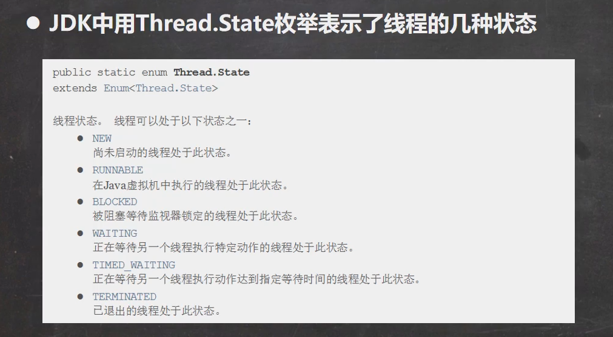

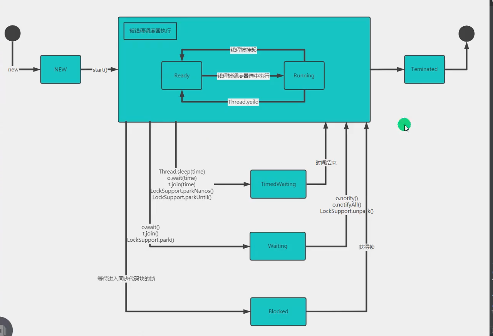

RUNNABLE可分为两种状态Ready和Running

## 线程同步机制

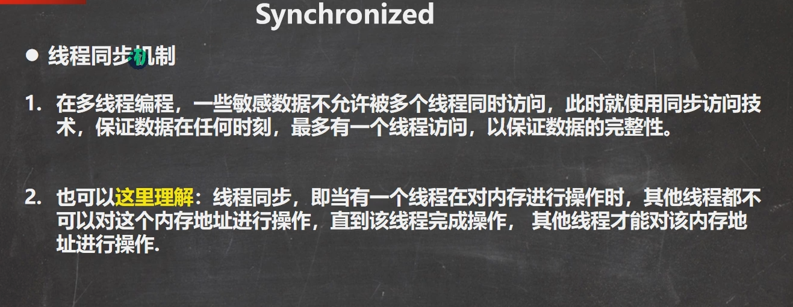


## Synchronized

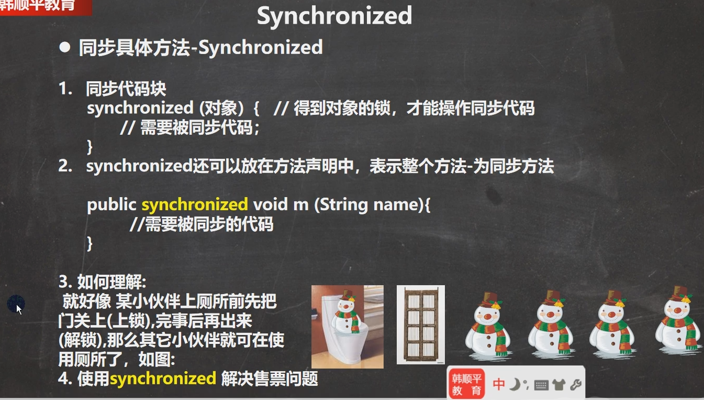

## 互斥锁

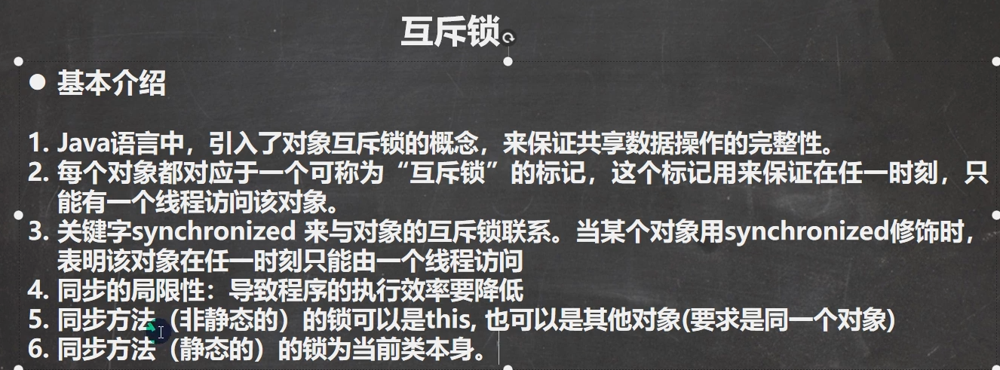


因为静态方法还没有对象就加载了，没法用实例对象，只能用类

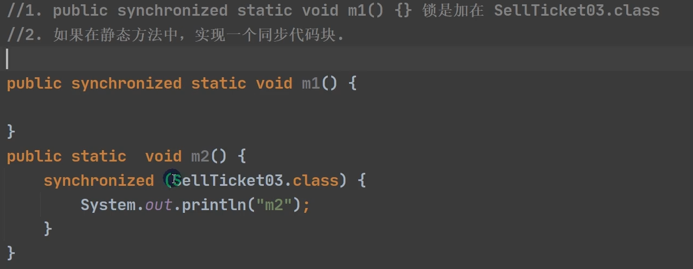


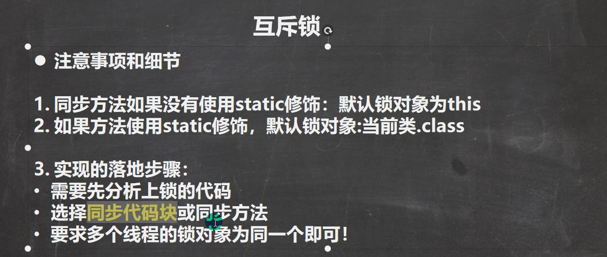

==关键是多个线程的锁必须是同一个==

## 线程的死锁

​	多个线程都占用了对方的锁资源，但不肯相让，导致了死锁

## 释放锁

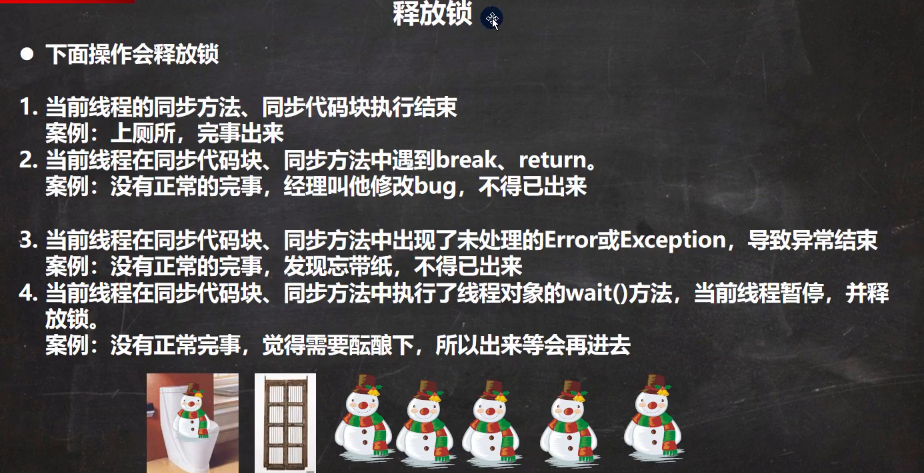


## 以下操作不会释放锁

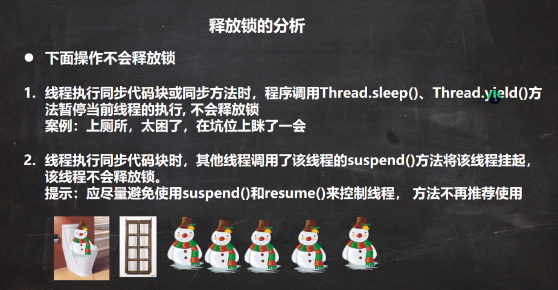

## 注意事项

一个程序执行

```java
public synchronized void getMoney(){

    if (count <= 0) {
        System.out.println("取钱完了。。。");
        loop = false;
        return;
    }

    count -= 1000;
    System.out.println(Thread.currentThread().getName()+"取了钱，剩余"+count);
    try {
        Thread.sleep(50);
    } catch (InterruptedException e) {
        e.printStackTrace();
    }
}

```


下面程序一次执行完是while循环退出， 线程控制的是一次程序结束。

线程争夺的是run方法的控制权

```java
public synchronized void getMoney(){
    while(true){
        if (count <= 0) {
            System.out.println("取钱完了。。。");
            loop = false;
            return;
        }

        count -= 1000;
        System.out.println(Thread.currentThread().getName()+"取了钱，剩余"+count);
        try {
            Thread.sleep(50);
        } catch (InterruptedException e) {
            e.printStackTrace();
        }   
    }
}
```

https://blog.csdn.net/mingyueyixi/article/details/50545681
