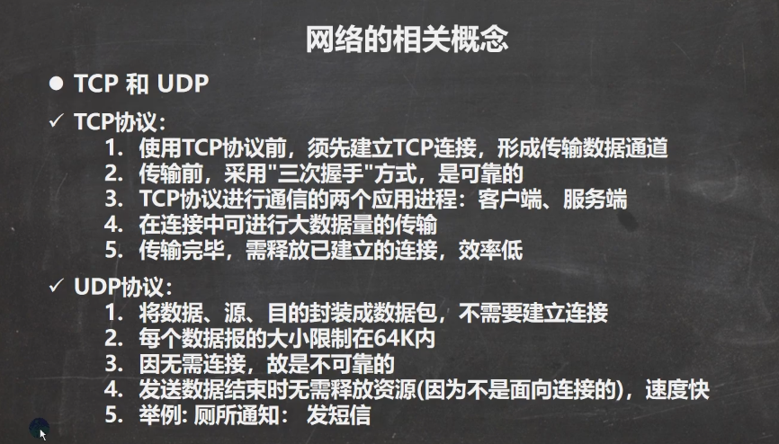

# 网络的相关概念

## 网络通信

## 网络

## ip地址

## 域名

## 网络通信协议

应用程序发出后会加一个Appl首部，经过TCP层会加TCP首部，经过IP层会加IP首部，最后在以太网传输的时候会加入以太网的首部和尾部

应用层类似于上图应用程序

传输层（TCP）

网络层（IP）

## TCP和UDP

## InetAddress类

## Socket

## TCP通信编程

## 第三题

## 第四题

## netstat指令

1.netstat -an 可以查看当前主机网络情况，包括==端口监听==情况和==网络连接==情况

2.netstat -an | more 可以分页显示

3.要求在dos控制台下执行

黄色圈圈

60285和8888建立网络连接

