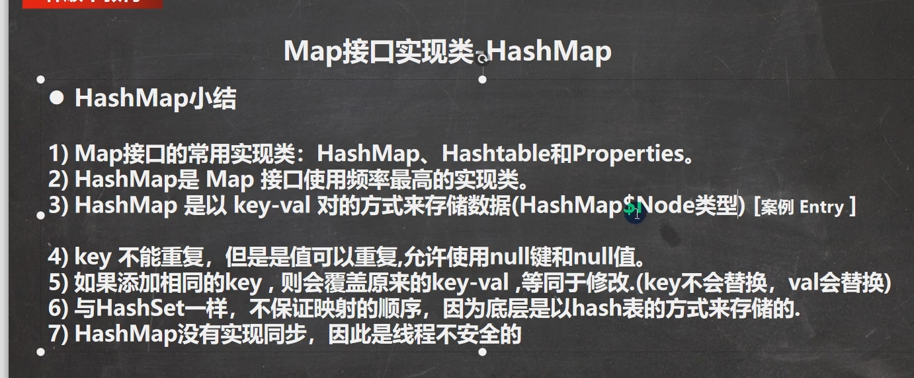
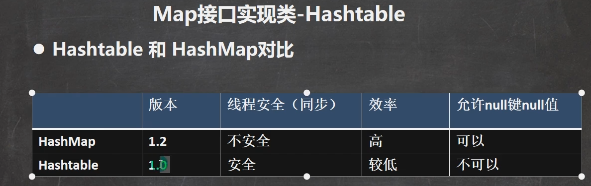

# 集合框架体系

集合可以动态保存任意多个对象，使用比较方便

提供了一系列方便的操作对象的方法：add、remove、set、get等

使用集合添加删除新元素非常简洁


# Collection

* collection实现的子类可以存放多个元素，每个元素可以是Object
* 区别是存放的元素是否可以重复和是否有序
* Collection接口没有直接的实现子类，是通过它的子接口Set和List来实现的


### **Java中Iterable和Iterator接口**

遍历器

````java
//快捷键itit
while (iterator.hasNext()) {
            Object next =  iterator.next();
            
        }
````

https://www.jianshu.com/p/cf82ab7e51ef

增强for底层是也是Iterator迭代器

快捷键 I


基本方法：

1. add
2. remove
2. get
3. contains
4. size
5. isEmpty
6. clear
7. addAll
8. containsAll 查看多个元素是否都存在
9. removeAll


## ==List==


List ==set== 方法相当于替换

List ==subList==(int fromIndex, int toIndex): 返回从fromIndex到toIndex位置的子集合，注意范围是[ )


**List的三种遍历方式 **

1. 使用iterator    快捷键 iitt

   ````java
   Iterator iter = col.iterator();
   //快捷键itit
   while (iterator.hasNext()) {
               Object next =  iterator.next();
               
           }
   ````

2. 使用增强for  快捷键 I

   ````java
   for(Object o:col){
   }
   
   ````

3. 使用普通for

4. forEach

   ````java
   list.forEach(System.err::println);
   ````

   

### Array List


为什么线程不安全 没有**synchronized**关键字 （线程互斥）


1.  transient 表示瞬间、短暂的，表示该属性不会被序列化

### Linked List

双向链表


### Vector


## ==Set==


取出的顺序虽然不是添加的顺序，但是它是固定的。

### Hash Set


**重复的对象能否加进去关键在于：**

​		是否**重写了hashcode和equals方法**，

​		hashcode计算出索引的位置，

​		equals比较与当前值是否相同。

==HashMap底层是数组+链表+红黑树==


==红黑树和链表可能同时存在==

```java
UNTREEIFY_THRESHOLD = 6
//当链表长度大于8时转换为红黑树，小于6时退化为链表，中间数是为了过度使用，防止链表与红黑树之间频繁的转换，造成效率低下。
```


哈希值的设计： ==这个值不是hashCode==  

我们拿到hashCode，这里的key.hashCode()是Object类型，无符号后移16位。

所以hash值不等于 hashCode

```java
static final int hash(Object key) {
    int h;
    return (key == null) ? 0 : (h = key.hashCode()) ^ (h >>> 16);
}
```


当前存储容量大于最大容量的75%，就会执行resize( )方法进行扩容；

--------------------------------------

add（）；数据结构中的hash链表

```java
public boolean add(E e) {
    return map.put(e, PRESENT)==null;
}
public V put(K key, V value) {
    return putVal(hash(key), key, value, false, true);
}

```

putVal中的部分细节：

hash值不重复直接插入，

重复的话，进行比较，内容是否重复

```java
(k = p.key) == key || (key != null && key.equals(k))
```

重复的话进行如下操作


```java
 final V putVal(int hash, K key, V value, boolean onlyIfAbsent,
                   boolean evict) {
        Node<K,V>[] tab; Node<K,V> p; int n, i;
     	//如果table为空 直接进行resize()，table初始化为16
        if ((tab = table) == null || (n = tab.length) == 0)
            n = (tab = resize()).length;、
        //进行位运算 $位运算符 1&1=1 , 1&0=0 , 0&1=0 , 0&0=0
       	//111 & 101等于101 = 5
        //计算p位置为空，直接插入
        if ((p = tab[i = (n - 1) & hash]) == null)
            tab[i] = newNode(hash, key, value, null);
        else {
            //新建一个e节点作为临时节点
            Node<K,V> e; K k;
            // 如果p位置节点不为空
            // p点的hash值等于准备插入元素的hash值 且
            // p点的key值等于准备插入元素的key值 或 p的key equals 准备插入元素的key值
            // 将p点赋值给e
            if (p.hash == hash &&
                ((k = p.key) == key || (key != null && key.equals(k))))
                e = p;
           	//当p是树节点的时候,进行树节点的添加操作
            else if (p instanceof TreeNode)
                e = ((TreeNode<K,V>)p).putTreeVal(this, tab, hash, key, value);
            //进行下面的条件
            //不满足下述条件
            //(p.hash == hash && ((k = p.key) == key || (key != null && key.equals(k))))
            //从p位置横向遍历
            else {
                for (int binCount = 0; ; ++binCount) {
                    //如果下一个节点为空，直接插入，此时需要判断是否需要树化
                    if ((e = p.next) == null) {
                        p.next = newNode(hash, key, value, null);
                        if (binCount >= TREEIFY_THRESHOLD - 1) // -1 for 1st
                            treeifyBin(tab, hash);
                        break;
                    }
                    //又进行同样的判断，是否存在相同的节点
                    if (e.hash == hash &&
                        ((k = e.key) == key || (key != null && key.equals(k))))
                        break;
                    p = e;
                }
            }
            //有相同的节点在这里处理
            //onlyIfAbsent默认是false
            //如果e不为空，onlyIfAbsent(absent缺席)，通过字面意思就能知道，如果这个值为 true，就不要               替换已经在表里的值。
            if (e != null) { // existing mapping for key
                V oldValue = e.value;
                if (!onlyIfAbsent || oldValue == null)
                    e.value = value;
                afterNodeAccess(e);
                return oldValue;
            }
        }
     	//每增加一个节点就加一
        ++modCount;
     	//大于临界值就扩容
        if (++size > threshold)
            resize();
        afterNodeInsertion(evict);
        return null;
    }
```

==关于第六条 64个以后开始树化==

首先到了链表上到达8个之后，没加一个数组都会扩容，16--》32--》64，并且索引会发生变化

原因：

索引位置是由按位异或后的hash值 然后与当前数组长度-1之后进行&运算得到的，所以索引是会变的

所以加第11个的时候 会进行树化

### Linked Hash Set


1. LinkHashSet 加入顺序和取出元素/数据的顺序一致

2. LinkHashSet底层维护的是一个LinkedHashMap(是HashMap的子类)

   证明如下：

   ```java
   LinkHashSet的构造方法都是调用父类HashSet的构造方法，
       public LinkedHashSet() {
       super(16, .75f, true);
   }
   即
   HashSet(int initialCapacity, float loadFactor, boolean dummy) {
       map = new LinkedHashMap<>(initialCapacity, loadFactor);
   }
   ```

   

3. LinkedHashSet底层结构 数据table+双向链表

4. 添加第一次时，直接将数组table扩容到16，存放的节点类型是LinkedHashMap$Entry

5. 数组是HashMap$Node[]  存放的元素/数据是 上述类型

### Tree Set

默认的输出的顺序按照自然排序，abcd...

采用匿名内部类的方式来进行实现各种排序

# Map


key值重复会直接替换


```java
//1. k-v最后是HashMap$Node node = newNode(hash, key, value, null)
//2. k-v为了方便 程序员遍历，还会创建EntrySet集合，该集合存放的元素类型Entry，而一个Entry对象就有 k，v EntrySet<Entry<k,v>> 即 
Set<Map.Entry<K,V>> entrySet;
//3.在EntrySet中，定义的类型是Map.Entry,但实际上存放的还是HashMap$Node
原因  static class Node<K,V> implements Map.Entry<K,V>
//4.当把HashMap$Node 对象存放到entrySet就方便我们遍历，因为 Map.Entry提供了getKey(),getValue()
```


==Map接口的六大遍历方法==

//(1)增强for

```java
Set keySet = map.keySet();
for(Object  key: keyset){
    System.out.println(key + "-" + map.get(key));
}
```

//(2)迭代器

```java
Iterator iterator = keyset.iterator();
while(iterator.hasNext()){
    Object key = iterator.next();
    System.out.println(key + "-" + map.get(key));
}
```

第二种思路：把所有的values取出

```java
Collection values = map.values();
//这里可以使用所有的Collections使用的遍历方法
1.增强for
2.迭代器
```

第三种思路：通过EntrySet来获取k-v

```java
Set entrySet = map.entrySet(); //EntrySet<Map.Entry<K,V>>
(1)增强for
    for(Object entry: entrySet){
        //将entry转成Map.Entry
        Map.Entry m = (Map.Entry) entry;
        Systeam.out.println(m.getKey() + "-" + m.getValue());
    }
(2)迭代器
    Iterator iterator = entrySet.iterator();
	while(iterator.hasNext()){
        //Object next =iterator.next();
        //这时候next是HashMap$Node
        //向下转型成
       // 接口实现类Node转换为接口Entry，属于动态绑定，向上转型。Object引用转为子类是向下转型
        Map.Entry m = (Map.Entry) entry;
        syst...
    }
```

LinkedHashMap实现LRU算法

```java

// 10是初始大小，0.75是装载因子，true是表示按照访问时间排序
HashMap<Integer, Integer> m = new LinkedHashMap<>(10, 0.75f, true);
m.put(3, 11);
m.put(1, 12);
m.put(5, 23);
m.put(2, 22);

m.put(3, 26);
m.get(5);

for (Map.Entry e : m.entrySet()) {
  System.out.println(e.getKey());
}
```


lambel表达式


## HashMap




为啥线程不安全：方法没有做同步互斥的操作，没有==synchronized==


## HashTable




为什么HashTable不能存null键和null值，而HashMap却可以？

key值为空的时候HashMap对应的hash操作直接返回0

```java
static final int hash(Object key) {
    int h;
    return (key == null) ? 0 : (h = key.hashCode()) ^ (h >>> 16);
}
```


具体链接：https://blog.csdn.net/qq_43386944/article/details/121485576


## Properties(implement HashTable)

读取的配置文件

增加用put

删除用remove

修改用put，同key 不同value

查找用

get

getProperty


## LinkedHashMap

## TreeMap

默认的输出的顺序按照自然排序，abcd...

采用匿名内部类的方式来进行实现各种排序


## Collection工具类


```java
java.util.collection
```


底部是再把当前值再赋值一遍

```java
 int cmp;
Entry<K,V> parent;
// split comparator and comparable paths
Comparator<? super K> cpr = comparator;
if (cpr != null) {
    do {
        parent = t;
        cmp = cpr.compare(key, t.key);
        if (cmp < 0)
            t = t.left;
        else if (cmp > 0)
            t = t.right;
        else
            return t.setValue(value);
    } while (t != null);
}
```


放入treeSet里的值必须实现实现comparable类，报ClassCastException错.


前提：重写了hashCode和equals方法，

首先添加进去P1，P2。

改了p1的name为CC后，

执行remove方法

```java
public V remove(Object key) {
    Node<K,V> e;
    return (e = removeNode(hash(key), key, null, false, true)) == null ?
        null : e.value;
}
```

remove方法通过hash来计算具体该删除的结点，此时P1的name发生了变化hash也变化了，所以remove无法找到P1的位置进行删除

加入P3（1001，'cc'）同理put函数经过hash运算之后不会和之前的P1发生冲突，P3直接加入，此时有3个节点

加入P4（1001，'AA'）这时候hash和初始P1相同，所以会和P1一个位置，但是内容value不一致，所以会挂载到后面。


==默认的hash和equals是根据对象地址确定的，只要地址一样就一样==